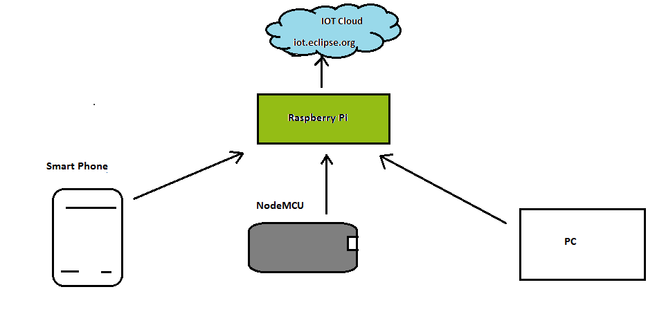
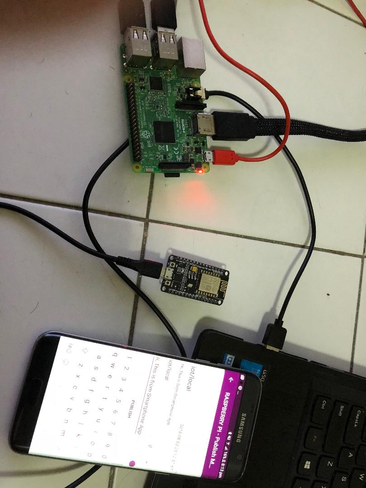

Building_IOT_Gateway
====================

Building Raspberry Pi as a IOT Gateway, getting data from Smart Phone, NodeMCU
and PC with creating a local network and publish the data to IOT
cloud-iot.eclipse.org.

Smart Phone, NodeMCU and PC are publishing their data to MQTT broker –Raspberry
Pi, providing IP address of Raspberry Pi as a broker address. Node-RED in
Raspberry Pi is used as Subscribing client, receive the data and display it
across cloud.

Here Mosquitto is being secured by creating username and password for the
clients to connect to it.

Requirements:

-   Raspberry Pi

-   NodeMCU

-   Smart phone

-   PC, USB cable and Jumper wires

Publish Clients – NodeMCU, Smart Phone, PC and Raspberry Pi

Broker – Raspberry Pi and iot.eclipse.org

Subscribe Clients – Raspberry pi and Node-RED

Code – Python programming and Arduino Programming

